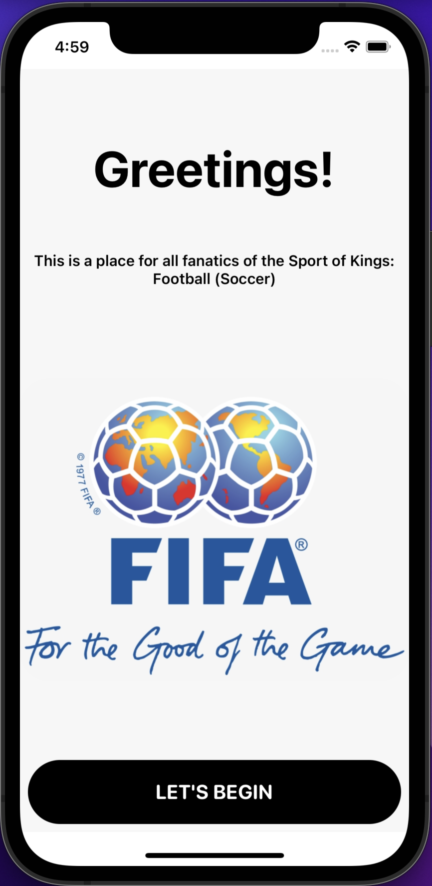
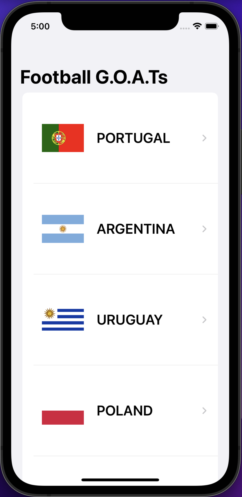
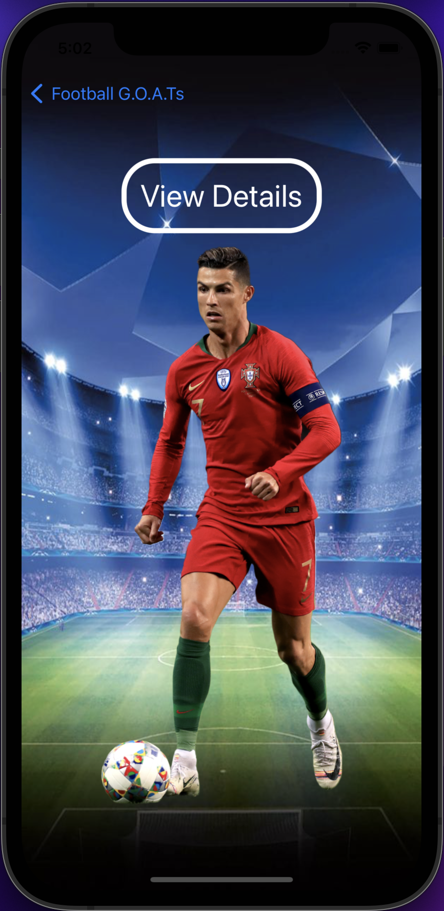
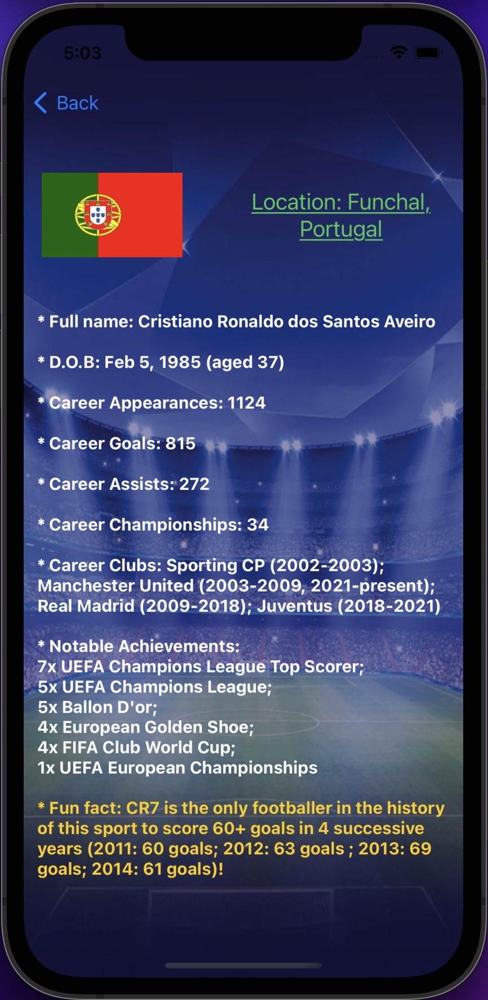
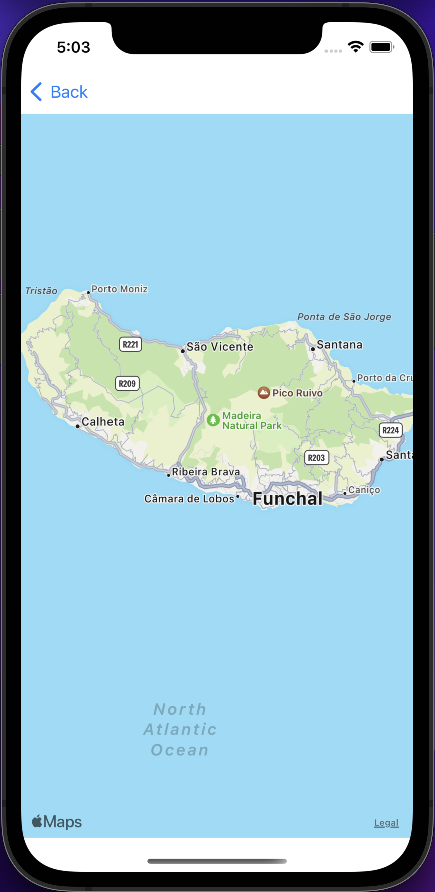

# Know Your Greatest App (Football G.O.A.Ts)

  

"A Haven for all fanatics of the Sport of Kings"

## 📖 Description

- This is an iOS application, inspired from my immense passion for the wonderful game of football (soccer for you Americans) :))
- The main content is essentially a list of the greatest footballers ever to grace the sport we all know and love by their country of origin
- The data displayed is processed from a standard JSON file, and the accuracy of the provided statistics are all true as of mid-2022 (susceptible to future changes)!

   
   
   
  
  

## 🔮 Live Demo (Animation GIF)

<table>
  <tr>
     <td>Know Your Greatest App with Welcome Screen and Map View</td>
  </tr>
  <tr>
    <td></td>
   </tr>
 </table>

## 🔧 Build Information
- Xcode 13.4.1
- SwiftUI Framework
- Target Deployment iOS >=15.5
- Library: CoreLocation for the MapKit

## 🏆 Author
- Giang Nhat Khanh (Kayden) - nhatkhanhgiang2512@gmail.com
